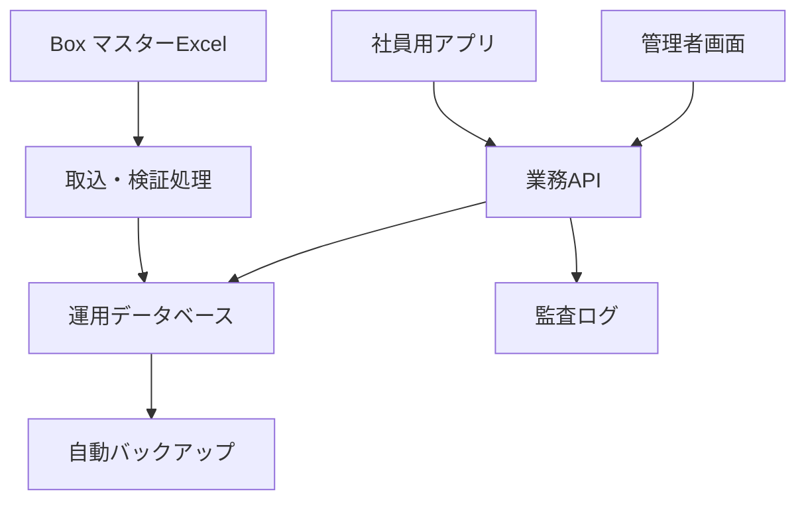

# 運転日報アプリ 本番化・ベンダー引継ぎ仕様

## 1. 目的

現在の試験アプリで確定した操作とデータ構造を維持し、会社承認後にベンダー管理の本番環境へ移行する。将来の別アプリでも、認証・マスター同期・監査・バックアップを共通利用できる構成にする。

## 2. 確定した業務仕様

- 社員は日報入力だけを行う。
- 車両ごとに前回の終了距離を次回の開始距離へ自動で引き継ぐ。
- 同一車両を複数人が同時入力した場合、更新番号で競合を検知して上書きを防ぐ。
- 日報履歴、月次集計、印刷、Excel出力は管理者だけが利用する。
- 月次管理は車両別、運転者別、アルコール補助記録、日報明細を持つ。
- アルコール欄は補助記録であり、正式記録は既存の専用ツールを正とする。
- 所属変更後も過去日報の所属名は保存時点の値を保持する。

## 3. 推奨構成

BoxのExcelを「編集する原本」、データベースを「アプリが高速・安全に使う運用コピー」とする。アプリが毎回BoxのExcelを直接読む構成にはしない。

## 4. インフラ選定

Supabase継続、Google Cloudへの移行のどちらでもよい。ただし、フロント画面が特定サービスへ直接依存しすぎないよう、業務APIの仕様を固定する。

Google Cloudを選ぶ場合の候補：

- Cloud Run：業務API、Box取込処理
- Cloud SQL for PostgreSQL：運用データベース
- Secret Manager：BoxやDBの認証情報
- Cloud Logging／Audit Logs：操作・障害記録
- Cloud Scheduler：定期同期
- Identity Platformまたは会社指定IdP：管理者認証
- Cloud Storage：バックアップ、月次出力保管

最終構成、可用性、費用、保守体制はベンダー提案とする。

## 5. セキュリティ責任分界

### 会社側

- 本番利用、個人情報、保存期間、管理者の承認
- Boxマスターの更新責任者と承認者の指定
- ベンダー作業の発注・変更承認
- 会社名義のクラウド契約と最上位管理者アカウントの保有

### ベンダー側

- 認証、権限、暗号化、秘密情報管理
- 脆弱性対応、ログ監視、バックアップ、復旧試験
- 本番・試験環境の分離
- マスター取込時の検証、差分表示、監査ログ
- 障害対応時間、保守窓口、退職・異動時の権限停止
- セキュリティ設計書、運用手順、復旧手順の提出

### 必須原則

- 社員用公開キーから日報一覧を取得できないこと。
- 日報の閲覧・出力は管理者権限だけにすること。
- DB管理者キーやBox秘密鍵をHTMLや端末へ埋め込まないこと。
- 削除、マスター反映、権限変更は監査ログへ残すこと。

## 6. 試験から本番への移行

1. 本番環境と試験環境を分離する。
2. 試験DBをバックアップする。
3. 会社承認済みのBoxマスターExcelを検証する。
4. 社員・所属・車両を本番DBへ登録する。
5. 車両ごとの本番開始距離を確認する。
6. 試験日報は「削除」または「試験データとして保管」を会社が選択する。
7. 削除する場合はベンダーが移行スクリプトで対象件数を事前表示し、承認後に実行する。
8. 権限、距離引継ぎ、同時入力、月次集計、Excel、印刷を受入試験する。
9. 本番切替日時を決めて利用開始する。

通常画面に「全データ削除」ボタンは設置しない。誤操作を避けるため、試験終了時の一括削除はバックアップ後に管理者限定の移行作業として行う。

## 7. 共通化して他アプリへ展開する機能

- 会社共通ログインと役割管理
- Boxマスター取込
- 差分確認と承認
- 変更履歴・監査ログ
- CSV／Excel／PDF出力
- バックアップと復旧
- 本番・試験環境切替
- 通知、エラー監視、利用状況記録

各アプリは業務固有の画面とテーブルだけを追加し、上記機能を共通基盤として再利用する。

## 8. ベンダー納品物

- システム構成図
- DB定義書、API仕様書、Box取込仕様書
- 権限一覧とセキュリティ設計書
- 本番移行計画、試験項目、試験結果
- バックアップ・復旧手順と復旧試験結果
- 操作マニュアル（社員用・管理者用）
- ソースコード、環境設定一覧、保守連絡体制
- 会社側で管理すべきアカウントと契約一覧

